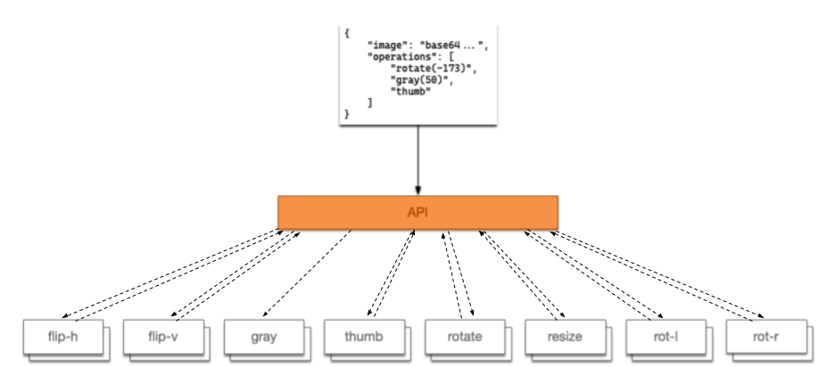
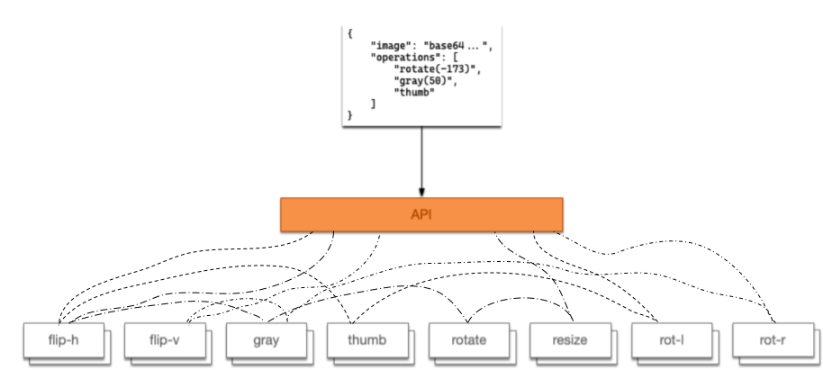

# CPSC5200 Final

David Souther <dsouther@seattleu.edu>
2020-03-16 Final

_(2 pts) Why do we introduce a knowledge level separate from an operational level when doing system analysis and design?_

When delivering a software system, the goal is to solve a specific domain problem.
Domain problems are independent of any particular technology.
Domain experts can provide (and in many cases, before software were providing) the same service.
The software system itself is incidental.
After deciding that the expense of the software solution is an appropriate use of business resources, the development team should keep in mind this separation of concerns.
The domain knowledge thus should be kept separate from the operational implications of the software solution.
At any time, it is the business' right and prerogative to replace the software with another solution.
Tying the domain knowledge deeply to the software deprives the business of this right.

_(5 pts) Assume we're implementing our image processor using a model where each transformation function is deployed in its own container, and that each container listens for work on a queue._

In a queuing architecture, each image processor has a pair of dedicated start/complete queues.
Each processor listens on the appropriate start queue for a "start operation" command.
This command includes the location of the image (stored out of band)\*, the destination of the image (again, stored out of band), the operation sequence ID, and any parameters necessary for the operation.
The processor does the work, and when finished, sends an "operation completed" messages on the appropriate complete queue containing the operation sequence ID.
In this way, the API is responsible for coordinating which tasks are to be done, which are outstanding, and which have been completed successfully overall.



\* The image data could be included in the message itself, but will require careful tuning of the message queue.

_(5 pts) In what ways could the image processor be implemented to use a pipe-and-filter architecture?_

In a pipe-and-filter architecture, the API will configure pipelines of the processing units.
It will have a wrapper that allows bundling parameters to a particular processing unit.
It will then configure these wrappers in order, such that the output of one wrapper is the input of the next.
The first receives the image data from the API, and the last provides the final image to the API.
Each wrapper understands how to call its associated processor with the input image data and attached parameters, and how to pass the resulting data to its output.



These approaches could be combined, where each wrapper uses the associated message queues to invoke the processors.

_(2 pts) Briefly explain use cases, for the following Gang of Four patterns:_

**Chain of Responsibility** allows a sender to prepare an operation & delegate it to a handler.
The handler is a thin wrapper around a collection of specialized handlers.
Each specialized handler examines each operation, and only operates on those it is configured to accept or knows how to process.
This allows decoupling the sending of a request from the set of possible handlers.
Indeed, many operations may not have an appropriate handler, in which case the operation is effectively a noop.
This type of low-guarantee patters is ideal for secondary non-critical information, such as a collection of loggers.
Each logger has a unique backend, and is configured to only write to that backend if the log message is of an appropriate severity.
With no loggers for INFO, no operation would be completed.

**Command** is a reified method call, otherwise known as inversion of control.
A command interface has one method, `execute`, which takes no arguments and will be called by a provided library or framework.
The object implementing the interface can carry as much information as it likes with it, to be used by the execute method.
(In functional languages, a command can store its parameters in a closure.)
Command is the basis of event oriented programming, where a specific event generating interface may apply additional constraints to the `execute` function, most often by passing it data about the event that occurred.

**Strategy**, like command, begins by exposing to the consumer an `execute` function (in a `Context` object).
The consumer may use the execute function at its leisure.
However, the producer of the Strategy does not provide any implementation inside the Context.
Instead, the context has a slot to provide one or more specific implementations for the operation.
Thus, the producer can decouple the choice of algorithm from the exposed interface the consumer will use.
(In some cases, that decision may happen dynamically, similar to chain of responsibility.)
A great place to use the strategy pattern is in encryption libraries, where providers can swap out increasingly complex encryption protocols without affecting consumer code.

**Factory Method** decouples instantiation of an interface from any specific class or constructor.
By hiding the choice of specific constructor from the consumer, the calling code only needs to know what shape they want to work with.
They then ask for this shape, calling one of potentially numerous methods on the factory to provide the necessary parameters.
My favorite use of this is actually a slight inversion of the pattern.
In this design, a base class needs several composite components to function.
The abstract base class exposes several functions to build each of these components, which the concrete subclasses can override to swap out only their specialized version of the components they need.

_(2 pts) Technological decisions impact the economics of your software projects. Besides these, what other factors or decisions may have an impact and why do we care?_

Two contributing factors I look towards when building a software project are the organization and the team.
The organization has its own direction and priorities.
A stealth-mode startup has very different needs and requirements of their technologies than an established industry player.
The startup may need to be able to pivot quickly to new business models, while the industry titan's regulatory requirements and time horizon are drastically more onerous and longer.
These dictate very different constraints for the project.

The team itself has a set of skills and backgrounds.
Their comfort may lie in hard-core pure functional programming, with all operations captured in precise monad forms.
Conversely, the time may be a cadre of bootcamp full stack grads, very familiar and comfortable with a specific stack but lacking in exposure to a range of technologies.
These teams will be better served by very different architectures, and that decision will impact the velocity and quality of the resulting deliverables.

_(2 pts) What does it mean "Take no dependencies, be not a dependency" and why is that something we might want to strive for in a software system?_

The libertarian ideal of software engineering, where I can just ignore everything around me in the world and pretend that only I exist.
Applying this principle today is somewhat more nuanced.
In many industries, taking no dependencies is simply untenable.
Do not write your own encryption, you will do it wrong.
More generally, the wealth of quality software both paid and FOSS would be a huge handicap to delivering a product in a timely manner.
That said, most software is specific to a single product or domain.
Most software shouldn't be used as a dependency, because it is so specific to one company's business model.
When software isn't tied that specifically to a single company and their constraints, taking on the burden of being a dependency is no small feat.

_(3 pts) Explain, in your own words, the second system effect as stated by Brooks. How can you avoid problems associated with the second system effect?_

The first time I build something, I underestimate how hard it will be, and don't build it enough.
The second time I build something, I overestimate how hard it will be, and build it way too much.
The third time I build something, I plan it just right, and build a system appropriate to the complexity of the problem.
This is my take on it, from my observations.
Fred Brooks has a different take, where the first system is small, restrained, and elegant.
The second iteration then gets overconfident, and adds "bloat" to the system as a whole.

Resolving second platform effect is, I think, a similar approach to the opinions in "take no / be not a dependency".
When Brooks wrote about OS/360 in the mid-70s, everything about networked "consumer" (b2b consumer) computing systems were new and untried.
The first systems, like the IBM700/7000, met their needs very well, but had difficulty scaling to a more generalist setting.
(Alternative read of history: IBM wanted to make more money with a new thing that was easier to support.)
There were no other systems to be a dependency on, and very little other players sharing their learnings and thoughts.
Today, we have decades of experience in all aspects of this field.
While there are still innumerable areas to continue pushing the state of the art, for most teams in most projects, the hard problems have been solved several times before.

To avoid teh second platform effect today requires being a researcher.
Other engineers have figured this out.
Ask them.
Figure out their constraints, figure out which constraints apply to you, and then learn about the systems that came before.
You can skip the first and second platforms because someone else already made them.
You can stand on their shoulders and go straight to the "third platform".

_(3 pts) What does "The magical number seven, plus or minus two" have to do with software architecture and design? In your opinion, is this really applicable to how we think about software?_

Coined by psychologist and early neuroscientist George Miller in the eponymous paper, human short-term memory can work on 5 to 9 "chunks" of information at a time.
A chunk is not a number, or a certain bit size of information, but rather is dictated by the interplay of short and long term memory.
This is important in software architecture, as a fundamental part of software architecture is the presentation of the information hierarchy and abstraction of a project.
When designing a system, the architect must understand their audience and the expected chunk granularity of the audience.
In this way,

_(3 pts) There are (at least) two classes of code generators. What are they and what distinguishes them? When might you choose one of them over the other and why? Give one example of each._

Code generation is a software technique whereby a program creates another program, algorithmically.
The fundamental example of this is a compiler, translating from one formal machine language to another.
Still, templating engines are perfectly cromulent examples of code generation.
These two also specify a range or spectrum of code generation tools, that you could call active to passive.
Active code generators look deeply into the source code, and can drastically change the output code based on their configuration.
Conversely, a passive templating system might be little more than sprintf concatenating strings which will be piped from stdout into xargs or [whatever this syntax is](https://stackoverflow.com/a/36428950/240358) in powershell.
Choosing between them is generally a tradeoff directed by the complexity of the problem space itself.
If the problem space is expected to be long lived with deep implications for future code, an active code generator where the codebase itself is primarily structured around these machine transformations is probably in order.
If it's a one-off script for executing some shell commands, I'll probably pipe into a subshell, paste some strings together, write them to a temp file, and execute that on the fly.

_(3 pts) Design patterns are intended to address the behavioral aspects of a given solution, domain objects discuss the concepts inherent in the problem domain. Discuss._

This is rephrasing the first question.
Design patterns are chunks of (hopefully) repeatable technical solutions to common problems which arise when creating software solutions.
Domain objects are specific implementations of concepts from the knowledge domain the software is working in.
Design patterns can be used across problems, businesses, domains, and even industries.
The are the unit or chunk of knowledge for the "domain" of software itself.
Domain objects are tied to the specifics of the solution at hand, and do not generalize across industries or often even businesses.
They encode the chunks of knowledge about the specifics of this system, rather than any system.

_(bonus - 5 pts) Assume we have the following API which lets a developer issue SQL INSERT and UPDATE statements in such a way that their execution is delayed until the developer calls Commit(). No statements are issued until Commit() is executed, and the execution order is guaranteed. Which design pattern (or patterns) would be applicable to the implementation of the API? Show how the pattern you've decided upon implements the above api (with code). You are free to change the interface definition into a format that works for your chosen language._

Broadly this is a composite pattern.
The manager keeps a list of operations to perform.
Each operation has a tree of sub-operations.
Primarily, this is for the Predicate but could be extended to column values.
Each component in the composite has some method (`toSql` in my solution) that creates the string and sanitizes parameters.
These components delegate down the tree structure that encodes the query shape.
The `insert`, `update`, and `delete` methods in the `QueryManager` act as factories to create the specific query instances.
Commit and Rollback work on the internal list of queries.

```{.ts}
enum BinaryOperation {
  Equals = "=",
  NotEquals = "!=",
  GreaterThan = ">",
  GreaterThanOrEquals = ">=",
  LessThan = "<",
  LessThanOrEquals = "<=",
  In = "IN",
  Like = "LIKE",
  IsNull = "isNull",
}

interface IPredicate {
  readonly columnName: string;
  readonly operation: BinaryOperation;
  readonly value: unknown;
}

interface IQuery {
  toSql(): string;
}

class Predicate implements IPredicate, IQuery {
  static from({ columnName, operation, value }: IPredicate) {
    return new Predicate(columnName, operation, value);
  }

  constructor(
    readonly columnName: string,
    readonly operation: BinaryOperation,
    readonly value: unknown
  ) {}

  toSql(): string {
    if (this.operation === BinaryOperation.IsNull) {
      return `${this.columnName} IS NULL`;
    } else {
      const val = sanitizeSQLParam(this.value);
      return `${this.columnName} ${this.operation} ${val}`;
    }
  }
}

class PredicateList {
  constructor(readonly predicates: Predicate[]) {}

  toSql(): string {
    return `WHERE ${this.predicates.map((p) => p.toSql()).join(" AND ")}`;
  }
}

function sanitizeSQLParam(value: unknown): string {
  //TODO make this safe
  // JSON.stringify adds quotes to strings.
  const val = JSON.stringify(this.value);
  return val;
}

function doSql(sql: string) {
  // TODO connect to a database
  console.log(sql);
  return Math.random() > 0.933; // I dunno it works most of the time I guess?
}

interface IQueryManager {
  // issues a SQL INSERT operation for tableName setting the provided
  // column values
  insert(tableName: string, columnValues: Record<string, unknown>): IQuery;

  // issues a SQL UPDATE operation for tableName setting the provided column
  // values and creating a WHERE clause from the predicates
  update(
    tableName: string,
    columnValues: Record<string, unknown>,
    predicates: IPredicate[]
  ): IQuery;

  // issues a SQL DELETE operation for tableName with a WHERE clause
  // from the predicates
  delete(tableName: string, predicates: IPredicate[]): IQuery;

  // causes the requested database operations to execute (returns true if at
  // least one row is effected), check the individual IQuery returns
  // from the above methods to determine the actual impact of each
  commit(): boolean;

  // abandons the requested database operations (returns false if there are
  // no operations)
  rollback(): boolean;
}

class QueryManager implements IQueryManager {
  private queries: IQuery[] = [];

  insert(tableName: string, columnValues: Record<string, unknown>) {
    const query = new InsertQuery(tableName, columnValues);
    this.queries.push(query);
    return query;
  }

  update(
    tableName: string,
    columnValues: Record<string, unknown>,
    predicates: IPredicate[]
  ) {
    const query = new UpdateQuery(tableName, columnValues, predicates);
    this.queries.push(query);
    return query;
  }

  delete(tableName: string, predicates: IPredicate[]) {
    const query = new DeleteQuery(tableName, predicates);
    this.queries.push(query);
    return query;
  }

  commit(): boolean {
    const sql = this.queries.map((q) => q.toSql()).join("\n\n");
    const result = doSql(sql);
    this.clearQueries();
    return result;
  }

  rollback(): boolean {
    if (this.queries.length === 0) return false;
    this.clearQueries();
    return true;
  }

  private clearQueries() {
    this.queries.splice(0, this.queries.length);
  }
}

class InsertQuery implements IQuery {
  constructor(
    readonly tableName,
    readonly columnValues: Record<string, unknown>
  ) {}

  toSql(): string {
    const columns = Array.from(Object.keys(this.columnValues)).join(", ");
    const values = Array.from(Object.values(this.columnValues))
      .map(sanitizeSQLParam)
      .join(", ");
    return `INSERT INTO ${this.tableName}\n(${columns})\nvalues (${values});`;
  }
}

class UpdateQuery implements IQuery {
  predicates: PredicateList;

  constructor(
    readonly tableName,
    readonly columnValues: Record<string, unknown>,
    predicates: IPredicate[]
  ) {
    this.predicates = new PredicateList(predicates.map(Predicate.from));
  }

  toSql() {
    const updates = Array.from(
      Object.entries(this.columnValues),
      ([k, v]) => `${k} = ${sanitizeSQLParam(v)}`
    ).join(", ");
    const predicate = this.predicates.toSql();
    return `UPDATE ${this.tableName}\nSET ${updates}\n${predicate};`;
  }
}

class DeleteQuery implements IQuery {
  predicates: PredicateList;

  constructor(readonly tableName, predicates: IPredicate[]) {
    this.predicates = new PredicateList(predicates.map(Predicate.from));
  }

  toSql() {
    const predicate = this.predicates.toSql();
    return `DELETE FROM ${this.tableName}\n${predicate};`;
  }
}

```
